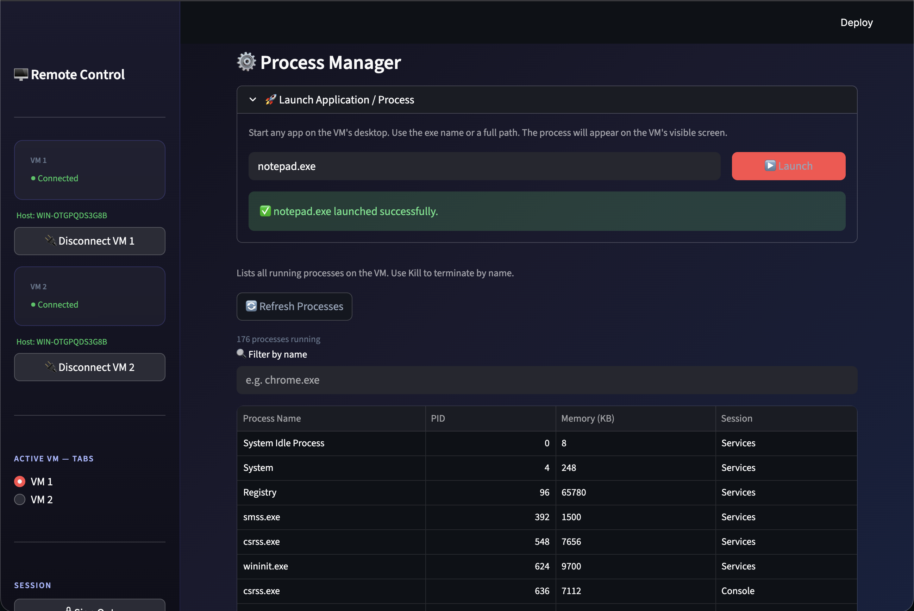
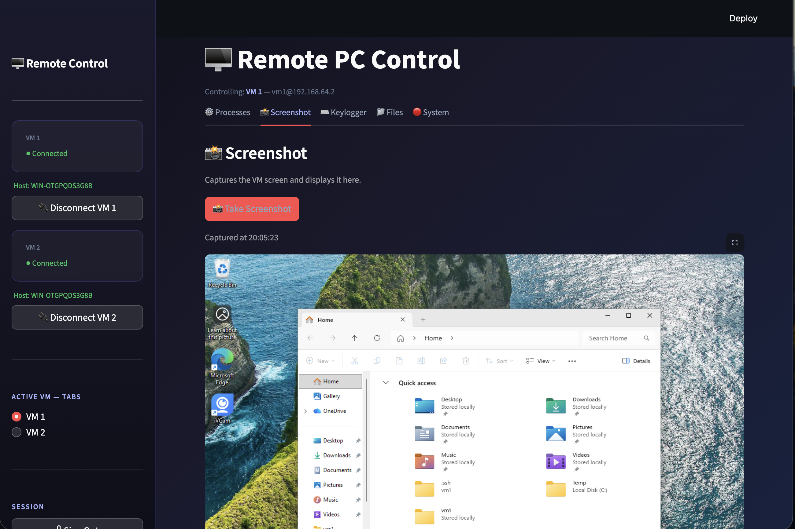
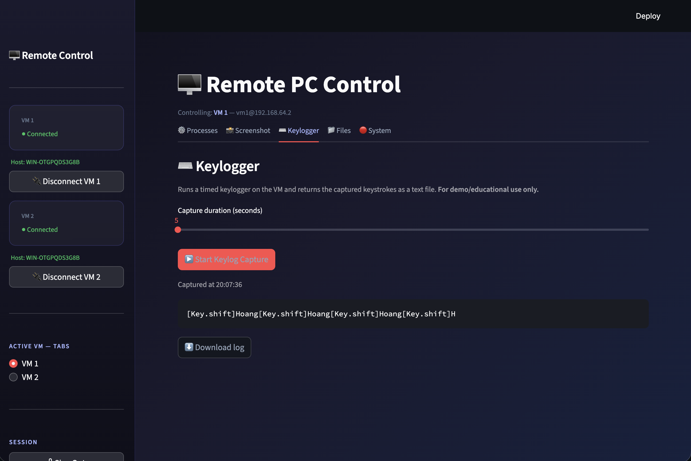
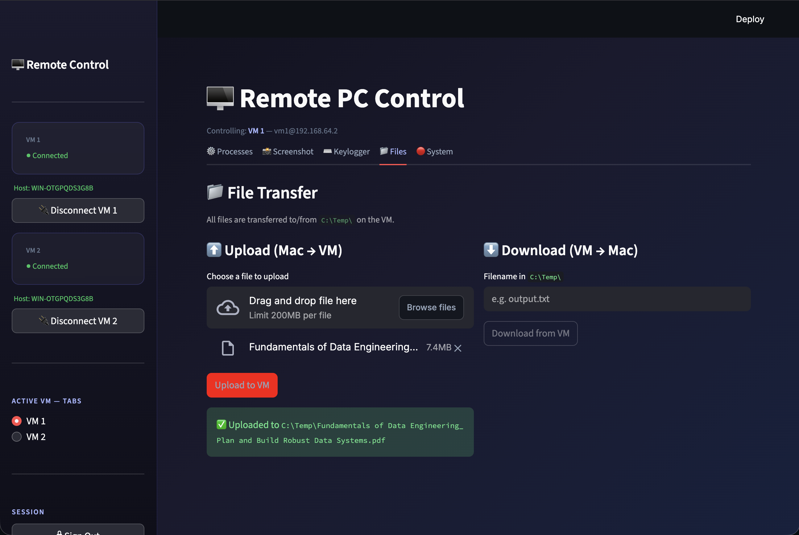
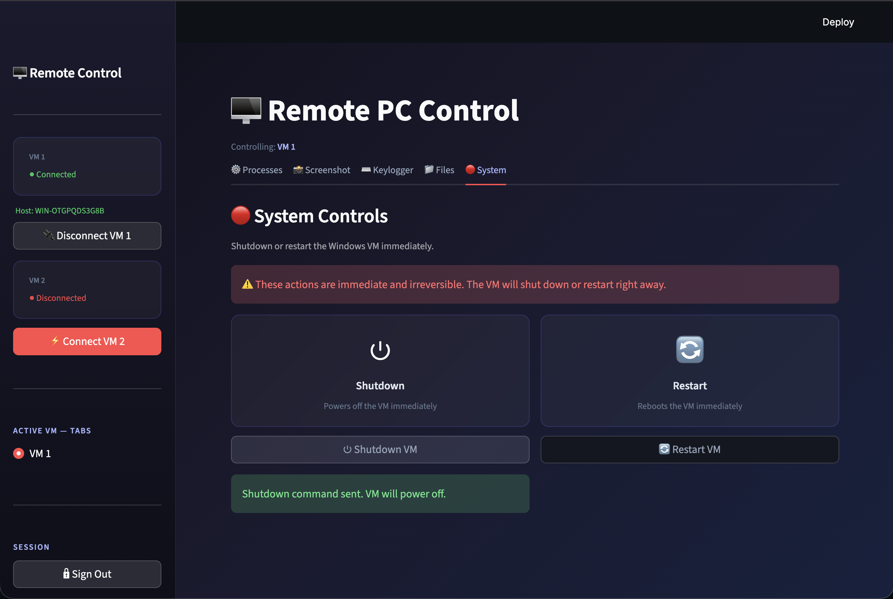

# 🖥️ Công cụ Điều khiển PC Từ xa

Ứng dụng web cho phép quản lý **hai máy ảo Windows 11** từ máy Mac thông qua giao diện Streamlit — sử dụng SSH/SFTP làm giao thức duy nhất, không cần cài agent hay phần mềm remote desktop bên thứ ba.

<!-- > **Mốc Giữa Kỳ** — Sprint 0–4 hoàn thành. -->


---

## Cơ chế Hoạt động

```
Mac (Streamlit tại localhost:8501)
         │
         │  SSH + SFTP  (xác thực khoá Ed25519)
         ▼
 ┌───────────────┐    ┌───────────────┐
 │   VM 1        │    │   VM 2        │
 │ 192.168.64.2  │    │ 192.168.64.4  │
 │ OpenSSH :22   │    │ OpenSSH :22   │
 └───────────────┘    └───────────────┘
         │
         └── C:\Temp\   (tất cả tệp đầu ra lưu tại đây)
         └── Task Scheduler  (cầu nối Session 0 → Session 1)
```
<!-- 
**Vấn đề cốt lõi — Session 0 Isolation:** Tiến trình SSH chạy trong Session 0 của Windows (không có màn hình). Các thao tác cần giao diện đồ họa (chụp màn hình, ghi phím) phải được chuyển sang Session 1 qua Windows Task Scheduler với `LogonType=Interactive`. Một tệp VBScript đảm bảo không có cửa sổ CMD/PowerShell nào xuất hiện trên màn hình VM. -->

---

## Điều khiển Nhiều VM

Thanh bên hiển thị cả hai VM cùng lúc. Người dùng có thể:
- **Kết nối / Ngắt kết nối** từng VM độc lập
- **Chuyển VM đang hoạt động** bằng nút radio — tất cả các tab (Tiến trình, Ảnh màn hình, Keylogger, Tệp, Hệ thống) tức thì chuyển sang VM được chọn
<!-- - Cả hai VM dùng chung một khoá SSH (`~/.ssh/id_ed25519`) -->
<!-- 
```ini
# .env
VM1_HOST = "192.168.64.2"
VM1_USER = "vm1"
VM2_HOST = "192.168.64.4"
VM2_USER = "vm1"
VM_KEY_PATH  = "~/.ssh/id_ed25519"
APP_PASSWORD = "mat_khau_cua_ban"
``` -->

---

## Tính năng

### ⚙️ Quản lý Tiến trình
- Liệt kê tất cả tiến trình (`tasklist /FO CSV`) — có tìm kiếm và lọc
- **Kill** tiến trình bất kỳ theo tên (`taskkill /IM tên /F`)
- **Khởi động** ứng dụng (ví dụ: `notepad.exe`) — chạy qua Task Scheduler trong Session 1 để xuất hiện trên màn hình thực của VM


### 📸 Chụp Màn hình
- Chụp màn hình thực của VM dùng `CopyFromScreen` (PowerShell + `System.Windows.Forms`)
- Thực thi hoàn toàn ẩn: `Task → wscript.exe → powershell -WindowStyle Hidden`
- Trả về ảnh PNG hiển thị và tải về ngay trên trình duyệt


### ⌨️ Ghi Phím (Keylogger)
- Ghi toàn bộ phím bấm trên VM trong khoảng thời gian định sẵn (5–60 giây)
- `pynput` chạy qua: `Task → wscript.exe → python.exe` (tất cả ẩn, chặn đến khi xong)
- Đường dẫn tuyệt đối tới `python.exe` được phân giải tự động để xử lý vấn đề PATH của Task Scheduler
- Trả về log văn bản, có thể tải về


### 📁 Truyền Tệp
- **Tải lên** tệp từ Mac → `C:\Temp\<tên>` trên VM qua SFTP
- **Tải xuống** tệp từ `C:\Temp\` trên VM → hộp thoại lưu của trình duyệt


### 🔴 Điều khiển Hệ thống
- **Tắt máy** và **Khởi động lại** từ xa với xác nhận hai lần
- Dùng lệnh `shutdown /s /t 0` / `shutdown /r /t 0`


---

## Cài đặt

```bash
# 1. Tạo môi trường ảo và cài gói
python3 -m venv .venv && source .venv/bin/activate
pip install -r requirements.txt

# 2. Cấu hình .env
cp .env.example .env   # điền VM1_HOST, VM2_HOST, VM_KEY_PATH, APP_PASSWORD

# 3. Chạy ứng dụng
streamlit run app/main.py
```

**Yêu cầu trên VM:** OpenSSH Server đang chạy, `id_ed25519.pub` của Mac đã thêm vào `authorized_keys`, `pynput` đã cài (`pip install pynput`).

---

## Cấu trúc Dự án

```
app/
├── main.py        # Giao diện Streamlit — xác thực, thanh bên, toàn bộ tab
├── ssh_client.py  # Toàn bộ logic SSH/SFTP (paramiko, không có mã UI)
└── config.py      # Nạp .env → danh sách VMS và hằng số
requirements.txt   # streamlit, paramiko, python-dotenv, pynput
```

---

## Hạn chế Đã biết

| Vấn đề | Ghi chú |
|---|---|
| Chụp màn hình ~8 giây | Overhead khởi động Task Scheduler |
| Keylogger `duration + ~10 giây` | Độ trễ khởi động task + buffer flush |
<!-- | Quay màn hình | Đã xoá; đang thiết kế lại cho giai đoạn cuối |
| Dùng chung một khoá SSH | Cả hai VM cần chấp nhận `id_ed25519` | -->
